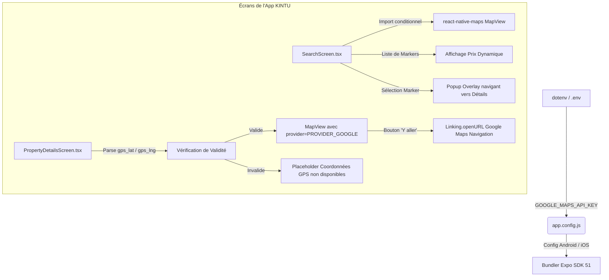

# Guide d'Intégration de la Plateforme Google Maps — Modèle KINTU

Ce document détaille la logique technique, la configuration et l'implémentation de **Google Maps** au sein de l'application mobile **KINTU**, servant de référence pour des architectures similaires (comme **KonGO**).

L'application utilise le SDK Google Maps natif sur Android et iOS via **`react-native-maps`**, garantissant des performances optimales, un style fluide et des contrôles de caméra natifs.

---

## Architecture Générale de l'Intégration



---

## 1. Configuration & Dépendances

L'application est construite sous **Expo SDK 51**. Les dépendances nécessaires dans `package.json` sont :

```json
"dependencies": {
  "expo": "~51.0.0",
  "react-native-maps": "1.14.0"
}
```

### Configuration des Clés API dans `app.config.js`
Pour que Google Maps s'initialise correctement dans les builds natifs, les clés doivent être enregistrées au niveau de la configuration native (Android et iOS). KINTU utilise un fichier de configuration dynamique `app.config.js` :

```javascript
require('dotenv').config();

const GOOGLE_MAPS_API_KEY = process.env.GOOGLE_MAPS_API_KEY || "TA_CLE_SECURISEE";

module.exports = {
  "expo": {
    "name": "KINTU",
    "slug": "kintu",
    "version": "1.0.0",
    
    // Configuration pour iOS (Intégration Google Maps au lieu d'Apple Maps)
    "ios": {
      "supportsTablet": true,
      "bundleIdentifier": "com.kintu.app",
      "config": {
        "googleMapsApiKey": GOOGLE_MAPS_API_KEY
      },
      "infoPlist": {
        "NSLocationWhenInUseUsageDescription": "KINTU utilise votre position pour afficher les lieux proches de vous.",
        "NSLocationAlwaysUsageDescription": "KINTU utilise votre position pour afficher les lieux proches de vous."
      }
    },
    
    // Configuration pour Android
    "android": {
      "package": "com.kintu.app",
      "config": {
        "googleMaps": {
          "apiKey": GOOGLE_MAPS_API_KEY
        }
      },
      "permissions": [
        "android.permission.ACCESS_FINE_LOCATION",
        "android.permission.ACCESS_COARSE_LOCATION"
      ]
    },
    
    "extra": {
      "googleMapsApiKey": GOOGLE_MAPS_API_KEY
    }
  }
};
```

---

## 2. Le Pôle Carte Interactive de Recherche (`SearchScreen.tsx`)

Le composant de recherche propose une double vue : **Liste** ou **Carte**.

### A. Chargement Défensif (Import Conditionnel)
Pour éviter que l'application ne plante sur des environnements non-natifs (comme le web ou un simulateur mal configuré), l'import de la carte est géré de manière dynamique à l'intérieur de la méthode de rendu :

```typescript
const renderMapView = () => {
  try {
    const MapView = require('react-native-maps').default;
    const { Marker, PROVIDER_GOOGLE } = require('react-native-maps');

    const defaultRegion = {
      latitude: -4.3276,   // Centré sur Kinshasa
      longitude: 15.3136,
      latitudeDelta: 0.3,
      longitudeDelta: 0.3,
    };

    return (
      <View style={{ flex: 1 }}>
        <MapView
          provider={PROVIDER_GOOGLE} // Impératif pour forcer Google Maps sur iOS
          style={StyleSheet.absoluteFillObject}
          initialRegion={defaultRegion}
          showsUserLocation={true}
          showsMyLocationButton={true}
          onPress={() => setSelectedMarker(null)}
        >
          {mapMarkers.map((marker) => (
            <Marker
              key={marker.key}
              coordinate={{ latitude: marker.lat, longitude: marker.lng }}
              onPress={(e: any) => { 
                e.stopPropagation(); 
                setSelectedMarker(marker.property); 
              }}
            >
              {/* Bulle personnalisée affichant le prix */}
              <View style={styles.markerBubble}>
                <Text style={styles.markerText}>
                  {marker.property.price} {marker.property.currency === 'CDF' ? 'FC' : '$'}
                </Text>
              </View>
            </Marker>
          ))}
        </MapView>
        
        {/* Compteur flottant */}
        <View style={styles.mapCountBadge}>
          <Text style={styles.mapCountText}>{mapMarkers.length} sur carte</Text>
        </View>
      </View>
    );
  } catch (e) {
    // Rendu alternatif si le module natif échoue
    return (
      <View style={styles.mapPlaceholder}>
        <MapPin size={40} color={colors.textMuted} />
        <Text style={styles.placeholderText}>Carte non disponible</Text>
        <Text style={styles.placeholderSub}>Utilisez la version native (expo run:android)</Text>
      </View>
    );
  }
};
```

### B. Gestion des Multi-Sites (Multi-Locations)
Une même entité (établissement, hôtel) peut avoir plusieurs points GPS dans la base de données. L'application extrait les positions secondaires stockées au format JSON dans `additional_locations` et les affiche sous forme de markers autonomes liés à la même entité :

```typescript
const mapMarkers = useMemo(() => {
  const markers: { property: any, lat: number, lng: number, key: string }[] = [];
  filteredProperties.forEach(p => {
    // 1. Point principal
    const mainLat = parseFloat(p.gps_lat);
    const mainLng = parseFloat(p.gps_lng);
    if (!isNaN(mainLat) && !isNaN(mainLng) && mainLat !== 0 && mainLng !== 0) {
      markers.push({ property: p, lat: mainLat, lng: mainLng, key: `main-${p.id}` });
    }
    
    // 2. Points secondaires (JSON Array)
    try {
      const additional = p.additional_locations;
      if (Array.isArray(additional)) {
        additional.forEach((loc: any, idx: number) => {
          const locLat = parseFloat(loc.gps_lat);
          const locLng = parseFloat(loc.gps_lng);
          if (!isNaN(locLat) && !isNaN(locLng)) {
            markers.push({ property: p, lat: locLat, lng: locLng, key: `add-${p.id}-${idx}` });
          }
        });
      }
    } catch (e) {
      console.warn('Erreur parsing locations secondaires', e);
    }
  });
  return markers;
}, [filteredProperties]);
```

### C. Fiche de Sélection Flottante (Popup Card)
Au clic sur un marqueur, l'état `selectedMarker` est mis à jour. L'utilisateur voit alors apparaître une fiche d'information animée en surcouche. Un clic sur cette fiche le redirige vers l'écran des détails complets :

```typescript
{selectedMarker && (
  <View style={styles.popupContainer}>
    <TouchableOpacity 
      style={styles.popupCard}
      onPress={() => {
        setSelectedMarker(null);
        navigation.navigate('PropertyDetails', { id: selectedMarker.id });
      }}
      activeOpacity={0.9}
    >
      <TouchableOpacity style={styles.popupClose} onPress={() => setSelectedMarker(null)}>
        <X size={14} color={colors.text} />
      </TouchableOpacity>
      <Image source={{ uri: selectedMarker.image }} style={styles.popupImage} />
      <View style={styles.popupInfo}>
        <Text style={styles.popupTitle} numberOfLines={1}>{selectedMarker.title}</Text>
        <Text style={styles.popupLoc}>{selectedMarker.location || selectedMarker.city}</Text>
        <Text style={styles.popupPrice}>{selectedMarker.price} $</Text>
      </View>
      <View style={styles.popupArrow}>
        <Text style={styles.popupArrowText}>›</Text>
      </View>
    </TouchableOpacity>
  </View>
)}
```

---

## 3. Le Pôle Affichage & Guidage Routier (`PropertyDetailsScreen.tsx`)

Dans la vue détaillée d'un lieu, KINTU propose une mini-carte interactive montrant l'emplacement du lieu ainsi qu'un bouton d'itinéraire direct.

### A. Validation Rigoureuse des Données GPS
Avant de tenter de charger la carte Google Maps, les coordonnées brutes stockées sous forme de chaînes ou de nombres sont validées :

```typescript
const lat = parseFloat(data.gps_lat);
const lng = parseFloat(data.gps_lng);
const isValid = !isNaN(lat) && !isNaN(lng) && lat !== 0 && lng !== 0;

if (!isValid) {
  // Rendu de remplacement si les coordonnées GPS sont erronées ou absentes
  return (
    <View style={styles.mapNoGpsContainer}>
       <MapPin size={36} color={colors.textMuted} />
       <Text style={styles.mapNoGpsText}>Coordonnées GPS non disponibles</Text>
       <Text style={styles.mapNoGpsSub}>{data.location || data.city}</Text>
    </View>
  );
}
```

### B. Intégration Native de la Mini-Carte
La mini-carte intègre la position de l'utilisateur (`showsUserLocation={true}`) et affiche des indicateurs de chargement natifs :

```typescript
<View style={styles.mapContainer}>
  <MapView
    provider={PROVIDER_GOOGLE}
    style={styles.map}
    loadingEnabled={true}
    loadingBackgroundColor="#1e293b"
    loadingIndicatorColor="#F97316"
    showsUserLocation={true}
    showsMyLocationButton={true}
    key={`map-${lat}-${lng}`}
    initialRegion={{
      latitude: lat,
      longitude: lng,
      latitudeDelta: 0.01,
      longitudeDelta: 0.01,
    }}
  >
    <Marker
      coordinate={{ latitude: lat, longitude: lng }}
      pinColor={colors.secondary}
      title={data.title}
    />
  </MapView>
</View>
```

### C. Guidage GPS via Redirection Universelle (Deeplinking)
Plutôt que d'essayer de coder un outil de navigation pas-à-pas complexe et coûteux dans l'application, KINTU s'appuie sur le moteur d'itinéraire natif du téléphone de l'utilisateur via un lien universel. 

Ce lien ouvre l'application native Google Maps (ou Apple Maps) configurée en mode itinéraire avec la destination pré-remplie :

```typescript
<TouchableOpacity 
  style={styles.mapDirectionBtn}
  onPress={() => {
    // Génère un schéma universel supporté sur iOS (via l'app Google Maps ou navigateur) et Android
    const url = `https://www.google.com/maps/dir/?api=1&destination=${lat},${lng}`;
    Linking.openURL(url).catch(() => {
      Alert.alert('Erreur', 'Impossible de lancer Google Maps sur votre téléphone.');
    });
  }}
>
  <Text style={styles.mapDirectionBtnText}>📍 Y aller</Text>
</TouchableOpacity>
```

---

## Leçons Clés pour l'Application KonGO

1. **Choix du Provider** : Toujours spécifier `provider={PROVIDER_GOOGLE}` sur le composant `<MapView>`. Par défaut sur iOS, `react-native-maps` utilise Apple Maps, ce qui peut créer des disparités de design, des manques d'adresses ou des incohérences de clés API.
2. **Robustesse et Fallbacks** : La géolocalisation ne doit jamais être un point de blocage. Toujours encapsuler les rendus dans des blocs `try/catch` et vérifier la validité des coordonnées avec `isNaN` pour afficher un fallback propre (ex. une icône grise avec l'adresse textuelle).
3. **Optimisation Web et Émulateurs** : L'utilisation de `require('react-native-maps')` dans les sous-fonctions permet d'exécuter l'application sur simulateur web sans générer d'erreurs de bundling sur les dépendances natives.
4. **Deeplinking Itinéraire** : Le schéma de navigation `https://www.google.com/maps/dir/?api=1&destination=LAT,LNG` est la méthode la plus fiable et performante pour offrir un guidage GPS clé en main aux clients sans surcharger le code de l'application.
