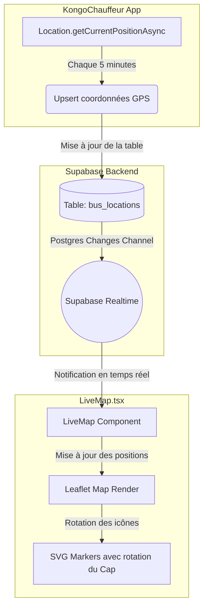

# Architecture & Implémentation du Suivi GPS en Temps Réel — KonGO

Ce document décrit en détail la logique d'intégration du système de géolocalisation et de suivi cartographique en temps réel de la plateforme **KonGO**. 

Le système repose sur une architecture à trois piliers :
1. **L'Émission** : Capture des coordonnées GPS sur l'application mobile chauffeur (**KongoChauffeur**) via les API de géolocalisation natives.
2. **Le Transport & La Persistance** : Stockage et diffusion instantanée des positions via la base de données **Supabase** et ses canaux de synchronisation PostgreSQL en temps réel (*Realtime Channels*).
3. **La Réception & La Visualisation** : Rendu cartographique interactif haute performance sur le backoffice web (**LiveMap.tsx**) utilisant la bibliothèque **Leaflet**, avec rotation dynamique des icônes selon le cap du véhicule.

---



---

## 1. Le Pôle Émission : Application Mobile Chauffeur (`KongoChauffeur`)

L'envoi des coordonnées GPS est géré au sein de l'application mobile chauffeur, spécifiquement dans l'écran de gestion du véhicule (`BusScreen.tsx`), en utilisant le module **`expo-location`**.

### Mécanisme de Capture & Fréquence
* **Permissions** : L'application demande explicitement les permissions de géolocalisation au premier plan (*Foreground Permissions*) via `Location.requestForegroundPermissionsAsync()`.
* **Cycle de vie du trajet** :
  * **Début du voyage** : Lorsque le chauffeur clique sur "Début du voyage", le statut du trajet passe à `in_progress` dans Supabase, et un intervalle régulier de mise à jour est initié (`setInterval` de 5 minutes : `GPS_INTERVAL_MS = 5 * 60 * 1000`).
  * **Fréquence** : Une première transmission a lieu immédiatement, puis toutes les 5 minutes.
  * **Fin du voyage** : Le chauffeur arrête le suivi en terminant le voyage. L'intervalle est détruit (`clearInterval`) et une position finale de repos (`status: 'idle'`) est envoyée.

### Code de capture et d'envoi (`BusScreen.tsx`)
```typescript
const sendPosition = useCallback(async () => {
  try {
    const { status } = await Location.requestForegroundPermissionsAsync();
    if (status !== 'granted') {
      setTrackingStatus('📍 Permission GPS refusée');
      return;
    }

    // Récupération de la position de haute précision
    const loc = await Location.getCurrentPositionAsync({
      accuracy: Location.Accuracy.High,
    });

    const { latitude, longitude, speed, heading, accuracy } = loc.coords;
    setLastPos({ lat: latitude, lng: longitude });

    if (!bus?.id || !dbDriverId) return;

    // Envoi à Supabase avec gestion du conflit sur le bus_id (mise à jour de la position existante)
    await supabase.from('bus_locations').upsert([{
      driver_id:   dbDriverId,
      bus_id:      bus.id,
      trip_id:     trip?.id || null,
      agency_id:   profile?.agency_id || null,
      latitude,
      longitude,
      speed:       speed ?? 0,
      heading:     heading ?? 0,
      accuracy:    accuracy ?? null,
      status:      'active',
      updated_at:  new Date().toISOString(),
    }], { onConflict: 'bus_id' });

    const now = new Date().toLocaleTimeString('fr-CD', { hour: '2-digit', minute: '2-digit' });
    setTrackingStatus(`✅ Envoyé à ${now}`);
  } catch (e) {
    setTrackingStatus(`⚠️ Erreur GPS: ${e.message}`);
  }
}, [driverId, bus, trip, profile]);
```

---

## 2. Le Pôle Persistance & Temps Réel (`Supabase`)

La persistance des positions GPS repose sur une table dédiée indexée de manière unique par véhicule pour ne garder en mémoire que le dernier état de géolocalisation connu de chaque bus.

### Structure de la Table `bus_locations`
* **`bus_id`** (UUID/FK, Clé Unique / Clé Primaire) : Garantit une relation 1:1 entre le véhicule et sa position GPS actuelle (évite la duplication).
* **`driver_id`** (UUID/FK) : Chauffeur actuellement au volant.
* **`trip_id`** (UUID/FK, Nullable) : Trajet en cours.
* **`latitude` / `longitude`** (Float) : Coordonnées géographiques.
* **`speed`** (Float) : Vitesse instantanée capturée en mètres/seconde, convertie en km/h.
* **`heading`** (Float) : Cap directionnel (angle en degrés de 0 à 359).
* **`status`** (String) : État du bus (`active` si en mouvement/voyage, `idle` si à l'arrêt).
* **`updated_at`** (Timestamp) : Horodatage de la dernière trame GPS reçue.

---

## 3. Le Pôle Réception & Rendu Cartographique (`LiveMap.tsx`)

L'affichage de la flotte sur la carte est orchestré dans l'application web d'administration de KonGO via le composant **`LiveMap`** (`LiveMap.tsx`).

### Rendu et Composants de la Carte
* **Moteur Cartographique** : Utilise la bibliothèque open source **Leaflet** (importée dynamiquement en React pour éviter les erreurs de rendu côté serveur/SSR des frameworks Web modernes).
* **Fonds de Carte** : Utilise le service **CartoDB Voyager** (`https://{s}.basemaps.cartocdn.com/rastertiles/voyager/...`) offrant un aspect visuel épuré et premium avec des contrastes optimisés pour les applications professionnelles.
* **Injection CSS** : Injection programmatique de la feuille de style Leaflet au chargement du composant pour assurer la portabilité de l'affichage sans modifier les configurations globales du projet.

### Calcul du Cap et Icônes Directionnelles Dynamiques
L'icône de chaque bus est générée dynamiquement sous forme de marqueur HTML/SVG (`L.divIcon`).
* **Rotation Géométrique** : L'icône est pivotée selon la valeur du cap (`bus.heading`) transmise par le GPS du téléphone du chauffeur.
* **Contre-Rotation du SVG** : Afin de maintenir le pictogramme du bus et les textes toujours lisibles (non renversés), le conteneur externe subit une rotation positive tandis que le SVG interne subit une contre-rotation négative équivalente :
  ```javascript
  const html = `
    <div style="transform: rotate(${bus.heading || 0}deg); background: ${color}; ...">
      <svg style="transform: rotate(-${bus.heading || 0}deg);" ...>
        <!-- Tracé SVG du Bus -->
      </svg>
    </div>`;
  ```
* **Indicateur de fraîcheur (Stale Positions)** : Si la mise à jour GPS date de plus de 10 minutes, la couleur du marqueur tourne automatiquement au gris neutre pour signaler aux administrateurs une perte potentielle de signal réseau du chauffeur.

### Synchronisation Réseau en Temps Réel
Plutôt que d'effectuer des requêtes répétées (*polling*), le composant écoute les changements directement sur la base de données grâce aux abonnements de canaux temps réel Supabase :

```typescript
useEffect(() => {
  fetchData(); // Premier chargement complet des données enrichies (Bus + Trajets + Chauffeurs)

  // Abonnement aux changements sur la table des positions GPS
  const channelLocs = supabase
    .channel("bus-locations-realtime")
    .on("postgres_changes", { event: "*", schema: "public", table: "bus_locations" }, (payload) => {
      setIsConnected(true);
      fetchData(); // Rafraîchissement automatique à chaque mouvement de bus
    })
    .subscribe((status) => {
      setIsConnected(status === 'SUBSCRIBED');
    });

  // Abonnement aux changements de statut des bus
  const channelBuses = supabase
    .channel("buses-realtime")
    .on("postgres_changes", { event: "*", schema: "public", table: "buses" }, () => {
      fetchData();
    })
    .subscribe();

  return () => { 
    supabase.removeChannel(channelBuses);
    supabase.removeChannel(channelLocs);
  };
}, [fetchData]);
```

### Conversion du Cap en Points Cardinaux
Pour un confort de lecture optimal dans la fiche d'information de la flotte, le cap en degrés est traduit en texte clair (Nord, Est, Sud, Ouest...) via la fonction suivante :
```typescript
function headingToLabel(h: number | null): string {
  const dirs = ['N', 'NE', 'E', 'SE', 'S', 'SO', 'O', 'NO'];
  return dirs[Math.round((h || 0) / 45) % 8] || '—';
}
```

---

## Synthèse des Points Forts de l'Intégration
1. **Économie de Batterie (Côté Mobile)** : L'utilisation d'une fréquence adaptative (5 minutes) préserve l'autonomie des téléphones des chauffeurs tout en offrant une précision de suivi adaptée à des trajets interurbains.
2. **Fluidité du Rendu (Côté Web)** : Leaflet combiné à des icônes SVG légères évite les surcharges mémoires sur les navigateurs web, permettant d'afficher des dizaines de véhicules simultanément sans baisse de framerate.
3. **Temps Réel Pur** : L'exploitation des WebSockets via les serveurs Realtime de Supabase garantit que toute modification de coordonnée GPS se répercute en moins de 500 ms sur les écrans de contrôle de l'administration.
